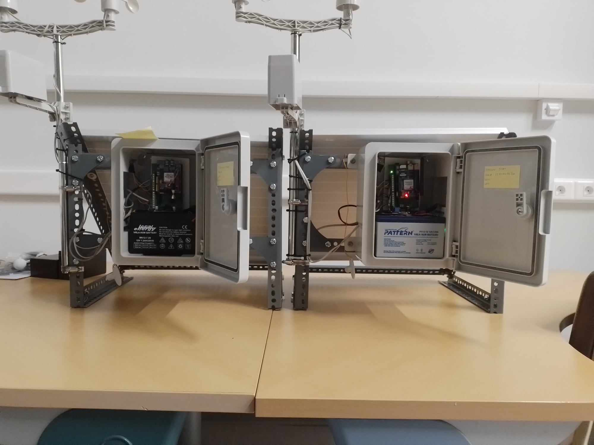
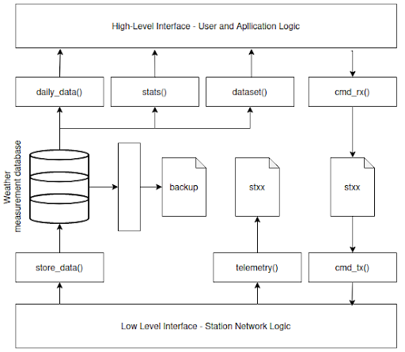
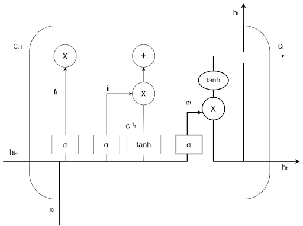

# UOA WSN Project <add the title of the paper here>

Weather monitoring and forecasting plays a crucial role in multiple aspects of our everyday lives. This project sets the initiatives for the implementation of a fully automated system for real-time weather monitoring of the fundamental meteorological parameters and their short-range forecasting. 

The system is divided into five core components:
1. Hardware COTS-based monitoring units
2. Data storage and management system
3. Data access and station control API
4. LSTM-based model for short-range predictions
5. Interactive web GUI

## Monitoring system

The monitoring system is based on COTS and open-source components. Each monitoring system comprises a power generation module, a set of sensors and a network adapter.
Power generation is based on solar radiation where the abundant solar energy is transformed into valuable electric energy via solar panels and stored/ distributed to the systems electronics. Also each unit is equipped with a rechargeable battery providing contiguous operation for at least 2 days per full charge at constant 12 VDC in case of cloudy days and nighttime. In Figure 1 two of our stations are depicted. 



**Figure 1** - The monitoring twin units

All actions of the station are coordinated and controlled by an Arduino Mega micro-controller board. Every unit operates on its own without external intervention controlling and monitoring its own state and adjusting the operation accordingly. 

TM/ TC and data transmission is based on the GPRS through a GSM adapter module. In that way data collection is independent of the internal mass storage and the local network infrastructure permitting real time monitoring at any geographical area of choice. Telemetry and data are transmitted directly upon recording to remote backend data handling systems offloading the units from storage requirements and telecommads are issued asynchronously also by a backend control systems. 

TM/ TC and data transmission utilize three virtual TCP/IP over HTTP links, following a server-client approach keeping the design as simple and efficient as possible. 

Figure 2 depicts the architecture of the monitoring units and Table 1 contains the sensors employed and their basic characteristics. The code for the controller can be found in `/station/wsn_main.ino`. In `/station/hardware_kicad.rar` you can find the design of the custom adapter board implemented to interface the Arduino Mega board, with the GSM/GPRS SIM900 shield, the sensors and the power lines respectively in a structured and well-organized manner. 

**Table 1** - The COTS sensors
| Parameter     | Range           | Accuracy/ Resolution | Device/ Component |
|---------------|-----------------|----------------------|-------------------|
| Humidity      |   0-100 [%]     |      +- 2  [%]       |     AM2315        |
| Temperature   |  -20-80 [C]     |      +-0.1 [C]       |     AM2314        |
| Pressure      | 0.3 - 110 [KPa] |      +-1  [hPa]      |     BMP280        |
| Rainfall      |      -          |      0.29 [mm]       |   Tipping bucket  |
| Wind Speed    |      -          |      2.4  [km/h]     |   Cup Anemometer  |
| Wind Direction|      -          |      22.5 [deg]      |    Wind Vane      |



**Figure 2** - The monitoring system architecture

## Data storage and management system 

Each weather station is a self-contained unit which communicates remotely with a backend data management and control system (server). The structure for the proposed backend system is depicted on Figure 3. The backend system comprises a database and a set of internet routines (we call them "handlers") that manage incoming requests from both station(s) and users. All handlers are implemented in PHP. You can find these handler routines in `/handlers` and use them to create the backend control and data management system. Table 2 contains the list of handlers and their functionality. The proposed server structure is provided in Tree 1. 

**Table 2** - The WSN backend handlers 
| Handler Name |        Description                                     |
|--------------|--------------------------------------------------------|
| daily_data   |  provides measurements collected for the current day   |
|   stats      |  provides statistics measured on daily basis           |
|  dataset     |  constructs a dataset for a selected time period       |
|  cmd_rx      |  interfaces the station controller with the user       |
|  cmd_tx      |  interfaces the station controller with the stations   |
| store_data   |  handles the incoming measurements from stations. Stores data both in the database and in a backup file       |
| telemetry    |  handles TM packets coming from stations               |



**Figure 3** - The backend system architectrue

``` 
\__ root
        \__ database
                \__ weather_data

        \__ station
        
                \__ telemetry_files
                
                \__ command
                        \__ command_files
                        \__ cmd_tx.php
                        \__ cmd_rx.php
                        
                \__ backup
                        \__ backup_file
                        
                \__ telemetry.php
                
                \__ store_data.php
                
                \__ connect.php
                
        \__ api
                \__data
                        \__ stats.php
                        
                        \__ dataset.php
                        
                        \__ daily.php
                        
                        \__ connect.php
```

**Tree 1** - The proposed server organization

## The pyWSN API

In order to support application development and easy access to data and control we developed a high level package in Python that encapsulates the complexity of the aforementioned handlers. The package contains the `Weather_Station_Backend_Controller` class which provides a set of member functions used for requesting data from the database and sending commands to monitoring units in the network. 

To utilize the package you need to instantiate a `Weather_Station_Backend_Controller` object passing it the root directory of your server (structured as shown in Tree 1). For insights on how to use the packages' member functions please refer to `/notebooks/wsn_api.ipynb`. 

## LSTM for short-range weather forecasting 

LSTM networks are specialized variant of RNN known for their distinctive ability to capture long term dependencies and expose intricate patterns within sequential data efficiently making them appropriate for modeling the meteorological variables. An LSTM cell as depicted in Figure 4 is a more complex network than the simple Vanilla RNN. Its unique features however make it capable of resolving many of the problems present in classic RNN variations such as the vanishing and exploding gradients situations. Fiugre 3 depicts the architecture of the LSTM cell.


**Figure 4** - The LSTM cell architecture

In this project we structured a simple but robust LSTM-based network for the task of predicting the air temperature, the relative air humidity, the barometric pressure and the wind speed respectively for a time-span of up to 2 hours in advance. We trained the model on data collected by our monitoring unit established in Psachna/ Euboia in the Department of Aerospace Science and Technology.

In `/notebooks/lstm_training.ipynb` you can find a detailed notebook used to train the LSTM-based short range predictors. The LSTM algorithms are implemented, trained and integrated in our applications through the Keras machine learning framework (https://keras.io/api/). The Keras API is very simple to understand and cope with, so anyone can learn how to use the training routines implemented to generate our predictors. By changing the parameter `timesteps` you can alter the look-back window (number of historical data samples to use) and by changing the parameter `window` you can alter the look-ahead window (number of time-steps to predict in future). 

You can contact us for a complete meteorological dataset, or you can properly modify the provided notebook to support your own dataset. 

## Creating a Django application

### Integrating the pyWSN package

### Integrating the LSTM model 

## Hosting the application

For hosting our application two different services are utilized. The commercial TopHost service (https://top.host) hosts our backend data handling and control system while the PythonAnywhere is utilized for deploying the web user interface application (https://www.pythonanywhere.com/). 

## Visit our web application portal 

**URL** : `https://uoawsn.pythonanywhere.com`

## For more information and insights on our project contact us

**Aerospace S&T Remote Sensing Lab** : `remotesensinglabaerost@gmail.com` 

**Ronaldo Tsela**      : `ron-tsela@di.uoa.gr` 

**Stella R. Maladaki** : `maladakistella@gmail.com` 

**Stavros Kolios**     : `skolios@aerospace.uoa.gr`

## Documentation

You can read our detailed documentation in `/docs`, where we describe the development and implementation steps, we provide user-manuals and explain design choices and considerations.
