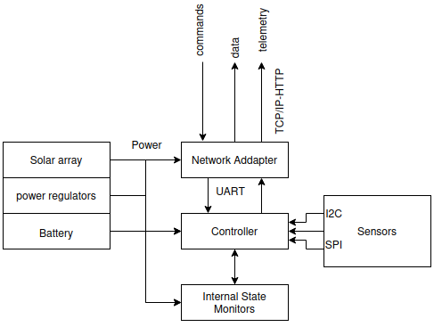

# UOA WSN Project <add the title of the paper here>

Weather monitoring and forecasting plays a crucial role in multiple aspects of our everyday lives. This project sets the initiatives for the implementation of a fully automated system for real-time weather monitoring of the fundamental meteorological parameters and their short-range forecasting. 

The system is divided into five core components:
1. Hardware COTS-based monitoring units
2. Data storage and management system
3. Data access and station control API
4. LSTM-based model for short-range predictions
5. Interactive web GUI

## Hardware 

The monitoring system is based on COTS and open-source components. Each monitoring system comprises a power generation module, a set of sensors and a network adapter.
Power generation is based on solar radiation where the abundant solar energy is transformed into valuable electric energy via solar panels and stored/ distributed to the systems electronics. Each unit is equipped with rechargeable battery providing contiguous operation for at least 2 days per full charge at constant 12 VDC.

All actions of the station are coordinated and controlled by an Arduino Mega board. Every unit operates on its own without external intervention controlling and monitoring its own state and adjusting the operation accordingly. 

TM/ TC and data transmission is based on the GPRS through a GSM adapter module. In that way data collection is independent of the internal mass storage and the local network infrastructure permitting in that way real time meteorological data collection at any geographical position of choice. telemetry and data are transmitted to remote backend data handling systems offloading the units and telecommads are issued asynchronously also by backend control systems. 

TM/ TC and data transmission utilize three virtual TCP/IP over HTTP links for TM, TC and data transmission respectively, following a server-client approach keeping the design as simple and efficient as possible. 

Figure 1 depicts the architecture of the monitoring units and Table 1 contains the sensors employed and their basic characteristics. The code for the controller can be found in `station/wsn_main.ino`. In `station/hardware_kicad.` you can find the design of the custom adapter board implemented to interface the Arduino Mega board, with the GSM/GPRS SIM900 shield, the sensors and the power lines respectively in a structured and well-organized manner. 

**Table 1** - The COTS sensors
| Parameter     | Range           | Accuracy/ Resolution | Device/ Component |
|---------------|-----------------|----------------------|-------------------|
| Humidity      |   0-100 [%]     |      +- 2  [%]       |     AM2315        |
| Temperature   |  -20-80 [C]     |      +-0.1 [C]       |     AM2314        |
| Pressure      | 0.3 - 110 [KPa] |      +-1  [hPa]      |     BMP280        |
| Rainfall      |      -          |      0.29 [mm]       |   Tipping bucket  |
| Wind Speed    |      -          |      2.4  [km/h]     |   Cup Anemometer  |
| Wind Direction|      -          |      22.5 [deg]      |    Wind Vane      |


**Figure 1** - The monitoring system architecture

## The proposed server structure

Each weather station is a self-contained unit which communicates remotely with a backend data management and control system (server). The structure for the proposed backend system is depicted on Figure 2. The backend system comprises a database and a set of internet routines (we call them "handlers") that manage requests. You can find these routines in `/handlers`. All handlers are implemented in PHP. Table 2 contains the list of handlers and their functionality. 

**Table 2** - The WSN backend handlers 
| Handler Name |        Description                                     |
|--------------|--------------------------------------------------------|
| daily_data   |  provides measurements collected for the current day   |
|   stats      |  provides statistics measured on daily basis           |
|  dataset     |  constructs a dataset for a selected time period       |
|  cmd_rx      |  interfaces the station controller with the user       |
|  cmd_tx      |  interfaces the station controller with the stations   |
| store_data   |  handles the incoming measurements from stations. Stores data both in the database and in a backup file       |
| telemetry    |  handles TM packets coming from stations               |


**Figure 2** - The backend system architectrue

## The proposed server organization
``` 
\__ root
        \__ database
                \__ weather_data

        \__ station
        
                \__ telemetry_files
                
                \__ command
                        \__ command_files
                        \__ cmd_tx.php
                        \__ cmd_rx.php
                        
                \__ backup
                        \__ backup_file
                        
                \__ telemetry.php
                
                \__ store_data.php
                
                \__ connect.php
                
        \__ api
                \__ stats.php
                
                \__ dataset.php
                
                \__ daily.php
                
                \__ connect.php
```
 
## Creating a Django application
- basic steps for creating a Django app
- steps to configure the Django app to look like ours

## Integrating the pyWSN package
- adding the pyWSN capabilities

## Training an LSTM network for short-range forecasting


## Integrating the LSTM model 

## Hosting the application

## Visit our web-site

**URL** : `uoawsn.pythonanywhere.com`

## For more information and insights on our project contact us

Aerospace S&T Remote Sensing Lab email : `remotesensinglabaerost@gmail.com` 

### Members

**Ronaldo Tsela**      : `ron-tsela@di.uoa.gr` 

**Stella R. Maladaki** : `maladakistella@gmail.com` 

**Stavros Kolios**     : `skolios@aerospace.uoa.gr`

### Documentation

Also you can read our detailed documentation in `/docs`, where we describe the development and implementation steps.
