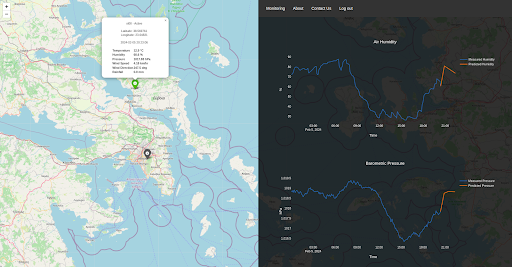

# WSN Project : 
## An integrated, automated and modular approach for real-time weather monitoring of surface meteorological variables and short-range forecasting using machine learning

Weather monitoring and forecasting plays a crucial role in multiple aspects of our everyday lives. This project sets the initiatives for the implementation of a fully automated system for real-time weather monitoring of the fundamental meteorological parameters and their short-range forecasting. 

The system is divided into five core components:
1. Hardware COTS-based monitoring units
2. Data storage and management system
3. Data access and station control API
4. LSTM-based model for short-range predictions
5. Interactive web GUI

## Monitoring system

The monitoring system is based on COTS and open-source components. Each monitoring system comprises a power generation module, a set of sensors and a network adapter.
Power generation is based on solar radiation where the abundant solar energy is transformed into valuable electric energy via solar panels and stored/ distributed to the systems electronics. Also each unit is equipped with a rechargeable battery providing contiguous operation for at least 2 days per full charge at constant 12 VDC in case of cloudy days and nighttime. In Figure 1 two of our stations are depicted. 

<p align="left" width="100%">
    
</p>

**Figure 1** - The monitoring twin units

All actions of the station are coordinated and controlled by an Arduino Mega micro-controller board. Every unit operates on its own without external intervention controlling and monitoring its own state and adjusting the operation accordingly. 

TM/ TC and data transmission is based on the GPRS through a GSM adapter module. In that way data collection is independent of the internal mass storage and the local network infrastructure permitting real time monitoring at any geographical area of choice. Telemetry and data are transmitted directly upon recording to remote backend data handling systems offloading the units from storage requirements and telecommads are issued asynchronously also by a backend control systems. 

TM/ TC and data transmission utilize three virtual TCP/IP over HTTP links, following a server-client approach keeping the design as simple and efficient as possible. 

Figure 2 depicts the architecture of the monitoring units and Table 1 contains the sensors employed and their basic characteristics. The code for the controller can be found at `/station/wsn_main.ino`. In `/station/hardware_kicad.rar` you can find the design of the custom adapter board implemented to interface the Arduino Mega board, with the GSM/GPRS SIM900 shield, the sensors and the power lines respectively in a structured and well-organized manner. 

**Table 1** - The COTS sensors
| Parameter     | Range           | Accuracy/ Resolution | Device/ Component |
|---------------|-----------------|----------------------|-------------------|
| Humidity      |   0-100 [%]     |      +- 2  [%]       |     AM2315        |
| Temperature   |  -20-80 [C]     |      +-0.1 [C]       |     AM2314        |
| Pressure      | 0.3 - 110 [KPa] |      +-1  [hPa]      |     BMP280        |
| Rainfall      |      -          |      0.29 [mm]       |   Tipping bucket  |
| Wind Speed    |      -          |      2.4  [km/h]     |   Cup Anemometer  |
| Wind Direction|      -          |      22.5 [deg]      |    Wind Vane      |


**Figure 2** - The monitoring system architecture

## Data storage and management system 

Each weather station is a self-contained unit which communicates remotely with a backend data management and control system (server). The structure for the proposed backend system is depicted on Figure 3. The backend system comprises a database and a set of internet routines (we call them "handlers") that manage incoming requests from both station(s) and users. All handlers are implemented in PHP. You can find these handler routines at `/handlers` and use them to create the backend control and data management system. Table 2 contains the list of handlers and their functionality. The proposed server structure is provided in Tree 1. 

**Table 2** - The WSN backend handlers 
| Handler Name |        Description                                     |
|--------------|--------------------------------------------------------|
| daily_data   |  provides measurements collected for the current day   |
|   stats      |  provides statistics measured on daily basis           |
|  dataset     |  constructs a dataset for a selected time period       |
|  cmd_rx      |  interfaces the station controller with the user       |
|  cmd_tx      |  interfaces the station controller with the stations   |
| store_data   |  handles the incoming measurements from stations. Stores data both in the database and in a backup file       |
| telemetry    |  handles TM packets coming from stations               |


**Figure 3** - The backend system architectrue

``` 
\__ root
        \__ database
                \__ weather_data

        \__ station
        
                \__ telemetry_files
                
                \__ command
                        \__ command_files
                        \__ cmd_tx.php
                        \__ cmd_rx.php
                        
                \__ backup
                        \__ backup_file
                        
                \__ telemetry.php
                
                \__ store_data.php
                
                \__ connect.php
                
        \__ api
                \__data
                        \__ stats.php
                        
                        \__ dataset.php
                        
                        \__ daily.php
                        
                        \__ connect.php
```

**Tree 1** - The proposed server organization

## The pyWSN API

In order to support application development and easy access to data and control we developed a high level package in Python that encapsulates the complexity of the aforementioned handlers. The package contains the `Weather_Station_Backend_Controller` class which provides a set of member functions used for requesting data from the database and sending commands to monitoring units in the network. 

To utilize the package you need to instantiate a `Weather_Station_Backend_Controller` object passing it the root directory of your server (structured as shown in Tree 1). For insights on how to use the packages' member functions please refer to `/notebooks/wsn_api.ipynb`. 

## LSTM for short-range weather forecasting 

LSTM networks are specialized variant of RNN known for their distinctive ability to capture long term dependencies and expose intricate patterns within sequential data efficiently making them appropriate for modeling the meteorological variables. An LSTM cell as depicted in Figure 4 is a more complex network than the simple Vanilla RNN. Its unique features however make it capable of resolving many of the problems present in classic RNN variations such as the vanishing and exploding gradients situations.


**Figure 4** - The LSTM cell architecture

In this project we structured a simple but robust LSTM-based network for the task of predicting the air temperature, the relative air humidity, the barometric pressure and the wind speed respectively for a time-span of up to 2 hours in advance. We trained the model on data collected by our monitoring unit established in Psachna/ Euboia in the Department of Aerospace Science and Technology.

`/notebooks/lstm_training.ipynb` is a detailed Python notebook used to train the LSTM-based short range predictors. The LSTM algorithms are implemented, trained and integrated in our applications through the Keras/Tensorflow machine learning framework (https://keras.io/api/). The Keras API is very simple to understand and to cope with, so anyone can learn how to use the training routines implemented to generate our predictors. By changing the parameter `timesteps` you can alter the look-back window (number of historical data samples to use) and by changing the parameter `window` you can alter the look-ahead window (number of time-steps to predict in future) respectively. 

You can contact us for a complete meteorological dataset, or you can properly modify the provided notebook to support your own dataset. 

## Creating a Django application

Visualizing data is also a very important task. In out project we developed a web-based graphical application for accessing and visualizing the real-time measurements and predictions using the Django Python framework (https://www.djangoproject.com/). Figure 5 depicts the main page of our application. Visit our web-site in https://uoawsn.pythonanywhere.com/ .



**Figure 5** - The real-time monitoring and short-range forecasting web-gui

Since the scope of this project is to propose a methodology for creating a complete application, here we provide the steps required to re-create our web-based user interface application. Once you complete these steps the result will be an interactive web-based graphical user interface for visualizing real-time meteorological data and short-range weather forecasts as depicted in Figure 5. However it should be noted that you must create a backend and monitoring system as predefined in order to see actual data in your application!

### Create a Python virtual environment 

A basic requirement is that you have locally installed python3. Also it is recommended to use python environments, however you can execute all of the following steps directly as well.

```
    sudo apt-get install python3-pip
    sudo apt-get install python3-virtualenv

    # create the virtual environment
    virtualenv django-venv

    # activate the environment
    source ./django-vevn/bin/activate
```

### Install the required python packages

```
    pip3 install folium 
    pip3 install pandas
    pip3 install django
    pip3 install keras==3.0.5
    pip3 install datetime
    pip3 install plotly
    pip3 install requests
    pip3 install tensorflow
```

### Start a Django project and create an application

```
    # start a new Django project and name it 'wsn'
    django-admin startproject wsn
    cd wsn
    
    # create a new application named 'wsn_app'
    python3 manage.py startapp wsn_app
```


### Configure the Django application 

Open the script `/wsn/wsn/settings.py` from your Django project and copy the `SECRET_KEY`. This key, uniquely defines your Django project and you don't want to lose it! Now replace your `/wsn/wsn/settings.py` with the `/wsn/wsn/settings.py` from the repository. Then paste your secret key to the respective variable within `settings.py`. Next add the email you want to use on this application. If your email does not have an app-password related to it then go to (https://support.google.com/mail/answer/185833?hl=en&fbclid=IwAR2kghBuaYLmnfkneKjONkA4fOxg_3Zi9ae8fEc9nNxUGgIpbK3S-OPkjBw) and get one for free! You can find the variable associated with the email and password by looking the related comments we provide. 

Replace the `/wsn/wsn_app/models.py` of your Django project with the `/wsn/wsn_app/models.py` from the repository. Next navigate to your project root directory `/wsn/` to perform the migration of these models in order to configure them.

```
    python3 manage.py makemigrations 
    python3 manage.py migrate
```

Replace the `/wsn/wsn/urls.py` of your Django project with the `/wsn/wsn/urls.py` from the repository. 

Replace the `/wsn/wsn_app/admin.py` of your Django project with the `/wsn/wsn_app/admin.py` from the repository. In the `admin.py` add your own server root directory in the `ROOT` global variable. Copy the `/pywsn/wsn_api.py` from the repository and paste it in the `/wsn/wsn_app` directory.

Replace the `/wsn/wsn_app/urls.py` of your Django project with the `/wsn/wsn_app/urls.py` from the repository. 

Replace the `/wsn/wsn_app/views.py` of your Django project with the `/wsn/wsn_app/views.py` from the repository. Subsequently add your server root directory in the `ROOT` global variable and your project email in the `EMAIL` global variable respectively within the `views.py`

Copy the `/wsn/wsn_app/forms.py` from the repository to your `/wsn/wsn_app/` directory and go to your root directory again in order to configure the projects' super-user by running the following command.

```
    python3 manage.py createsuperuser --username Admin
```

Provide the super-users' email and set a password as requested from the manager tool.

Lastly copy the `/wsn_app/media/` and `/wsn_app/static/` directories from the repository and paste them to your Django project in `/wsn/` and `/wsn/wsn_app/` directories respectively. The `media` folder contains the HTML template files for the project (including CSS and JavaScript scripts) while the `static` folder contains the static graphics such as the images for the application. 

### Integrate the LSTM predictors

In order to make short-range predictions you must first provide the related Keras models. We provide with the required models in `/wsn/wsn_app/predictors/`. Else you can train your own models, save and export them by using the `/notebooks/lstm_train.ipynb` notebook. You must keep in mind that the application is configured to plot predictions for 30 minutes, 1 hour and 2 hours ahead, meaning that you must configure the `window` parameter appropriately. The exported models must be of type .keras zip with names as `lstm-30min.keras`, `lstm-1hr.keras` and `lstm-2hr.keras` respectively and stored in `/wsn/wsn_app/predictors` directory of your Django project.

### Run the application 

To run the application from your localhost, start the localhost Django server by issuing the following command.

```
    python3 manage.py runserver
```

Next open a browser and search for your localhost (http://localhost:8000/). The application must start. Log in and have fun!

For more insights on how to use and further configure the application please refer to the related document (`/docs/meteo_stations - WSN web application user manual-V2.pdf`

## Hosting the application

For hosting our application two different services are utilized. The commercial TopHost service (https://top.host) hosts our backend data handling and control system while the PythonAnywhere is utilized for deploying the web user interface application (https://www.pythonanywhere.com/). Every host has its own "rules" and further configurations to be made in your applications to be deployed. Read carefully their requirements. For information about hosting your Django application on Heroku, Ubuntu or PythonAnywhere server you can also contact us!

## For more information and insights on our project contact us

**Aerospace S&T Remote Sensing Lab** : `remoteSensingLabAeroST@gmail.com` 

**Ronaldo Tsela**      : `ron-tsela@di.uoa.gr` 

**Stella R. Maladaki** : `maladakistella@gmail.com` 

**Stavros Kolios**     : `skolios@aerospace.uoa.gr`

## Documentation

You can read our detailed documentation in `/docs`, where we describe the development and implementation steps, we provide user-manuals and explain design choices and considerations.
